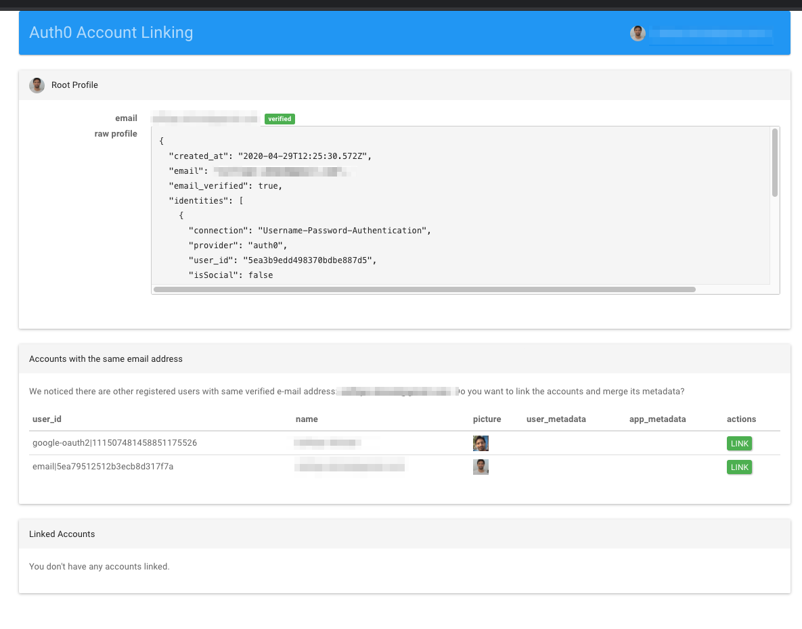
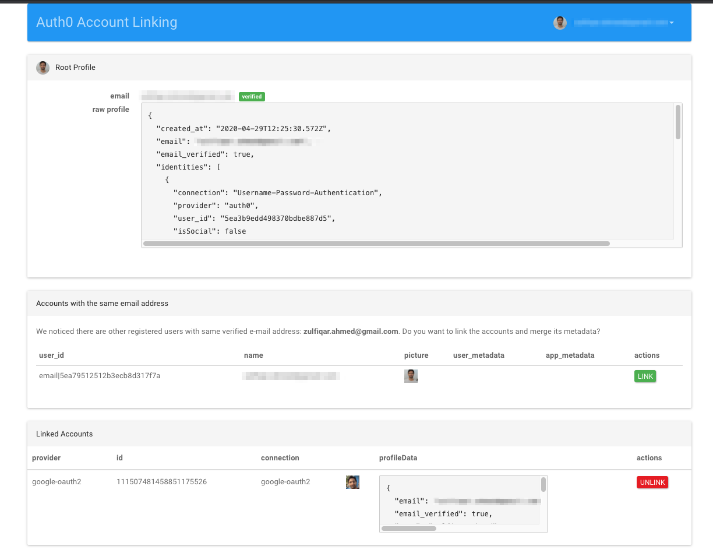
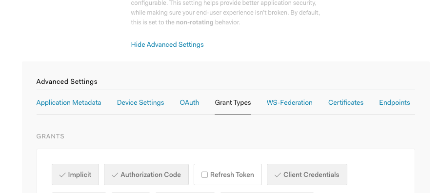
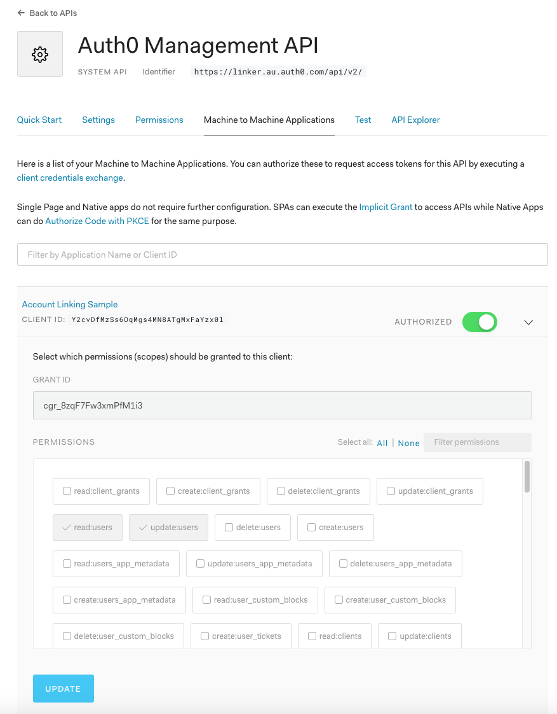

# Auth0 Node.js Regular Web App Account Linking Sample

This Node.js Regular Web App serves as an example of the [Suggested Account Linking Scenario](https://auth0.com/docs/link-accounts/suggested-linking), where the App searches for other accounts with same verified email address after user logs in, and suggests him to link the accounts if any match is found.

## Key Features

- Login with any available connection using [Universal Login](https://auth0.com/docs/universal-login)
- Suggestion of linking to other accounts if other accounts with same verified email address are found
- [Re]-authentication of the target user **before** account linking
- Verfication of the reauthenticated target user **before** account linking
- Automatically merge user_metadata and app_metadata on account linking
- Display of current profile and linked accounts
- Option to unlink an account





## Install Locally

1. Install Node.js v12.16.2 or later
2. Add a .env file containing your config. You can use sample.env as template.
3. Create a "Regular Web Application" using [Auth0 Dashboard](https://manage.auth0.com) and enable [Implict, Authorization Code and Client Credentials grants](#grant-types)
4. In your App's configuration on the [Auth0 Dashboard](https://manage.auth0.com), add `http://localhost:3000/callback, http://localhost:3000/link/callback` to the list of **Allowed Callback URLs** and `http://localhost:3000` to **Allowed Logout URLs** list.
5. [Grant "read:users update:users"](#management-api-scopes) scopes to your "Regular Web App".
6. Make sure you have at least two enabled econnections where you can login with the same email. A Database and a Social provide a good simple testing setup.
7. Run: `npm install` and `npm run start`
8. Go to `http://localhost:3000` and you'll see the app running :).

## Debugging

The sample uses [debug npm package](https://www.npmjs.com/package/debug) and debugging can be enabled as:

```bash
export DEBUG=auth0-link-accounts-sample
npm start
```

## Usage

- Go to http://localhost:3000 and press login buttons to log in to the App.
- In order to see the suggestion to link to other accounts with same verified email, you need to have another user associated with the app. If you don't see it, you can logout and login again with another account with same email.
- In order to test the merging of app_metadata and user_metadata, make sure both users have some data before linking the accounts.
- You will see a modal suggesting you to link the accounts that have same verified email addresses.
- Click the button to link the accounts.
- Try unlinking accounts, too.

### Grant Types



### Management API Scopes


