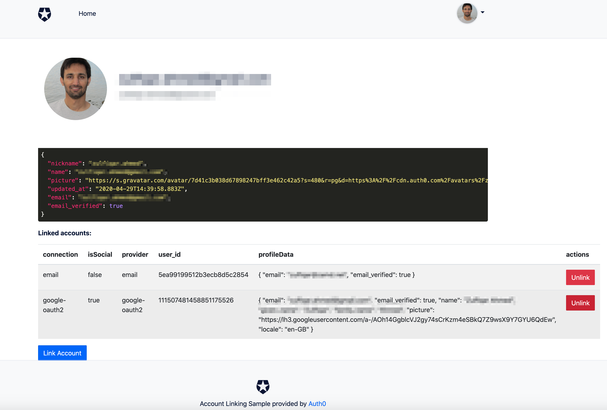

# Auth0 SPA (Vanilla JS) Account Linking Sample

This Single Page App serves as an example of the [User Initiated Account Linking Scenario](https://auth0.com/docs/link-accounts/user-initiated), where the user can click on a **Link Account** button and login with other identity to link to.

```
For security reasons, the user performing the account linking and the account being linked must both email_verified set to true. The sample will enforce this constrain during account linking.
```

## Key Features

- Login with any available connection using [Universal Login](https://auth0.com/docs/universal-login)
- Display of current profile and already linked accounts
- Option to unlink an account
- Option to link another account



## Install Locally

1. Make a copy of `auth_config.json.example` and rename it to `auth_config.json`. Then open it in a text editor and supply the client_id and domain values for your application. You can get the client_id and domain from the [Auth0 Dashboard](https://manage.auth0.com).
2. In your App's configuration on the [Auth0 Dashboard](https://manage.auth0.com), add `http://localhost:3000` to the list of **Allowed Callback URLs**, **Allowed Logout URLs** and **Allowed Web Origins**.

3. From the SPA folder, run:

```
- npm install
- npm start
```

4. Go to the [index page](http://localhost:3000) and start playing with the app!
